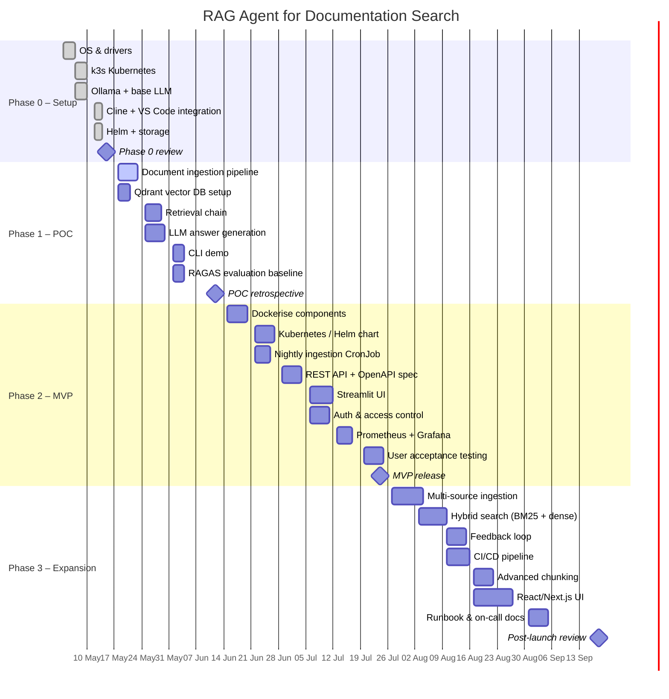

# GANTT Chart – RAG Agent Project

The chart below uses [Mermaid](https://mermaid.js.org/) syntax and renders automatically on GitHub.

## Timeline Summary

| Phase | Start | End | Duration |
|---|---|---|---|
| 0 – Environment Setup | Week 1 (2026-05-04) | Week 2 (2026-05-15) | 2 weeks |
| 1 – POC | Week 3 (2026-05-18) | Week 6 (2026-06-12) | 4 weeks |
| 2 – MVP | Week 7 (2026-06-15) | Week 12 (2026-07-24) | 6 weeks |
| 3 – Expansion | Week 13 (2026-07-27) | Week 20 (2026-09-18) | 8 weeks |
| **Total** | | | **20 weeks** |

## Key Milestones

| Milestone | Date |
|---|---|
| Phase 0 complete – platform ready | 2026-05-15 |
| Phase 1 complete – POC validated | 2026-06-12 |
| Phase 2 complete – MVP live | 2026-07-24 |
| Phase 3 complete – full system | 2026-09-18 |
